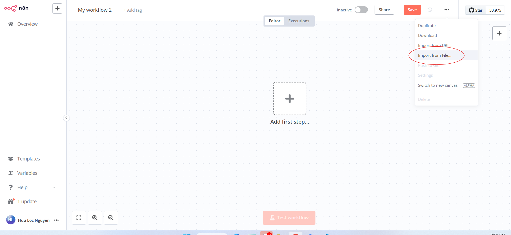
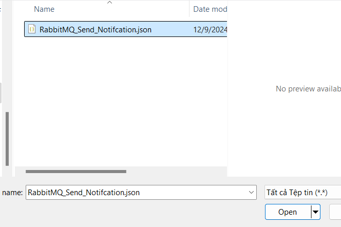
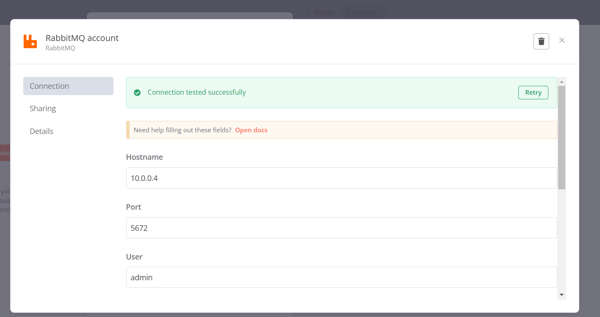
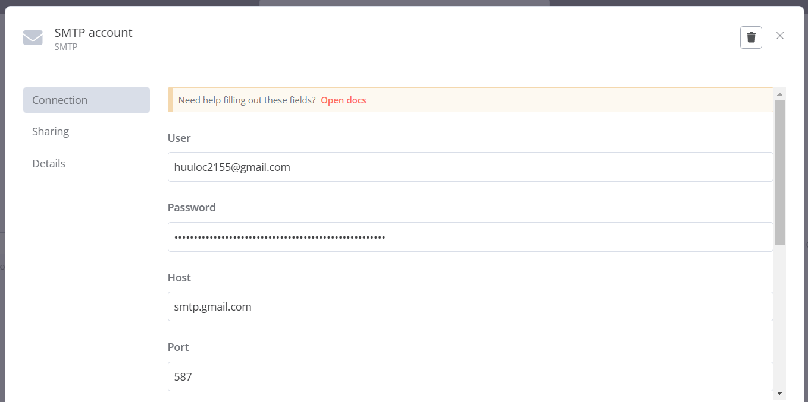
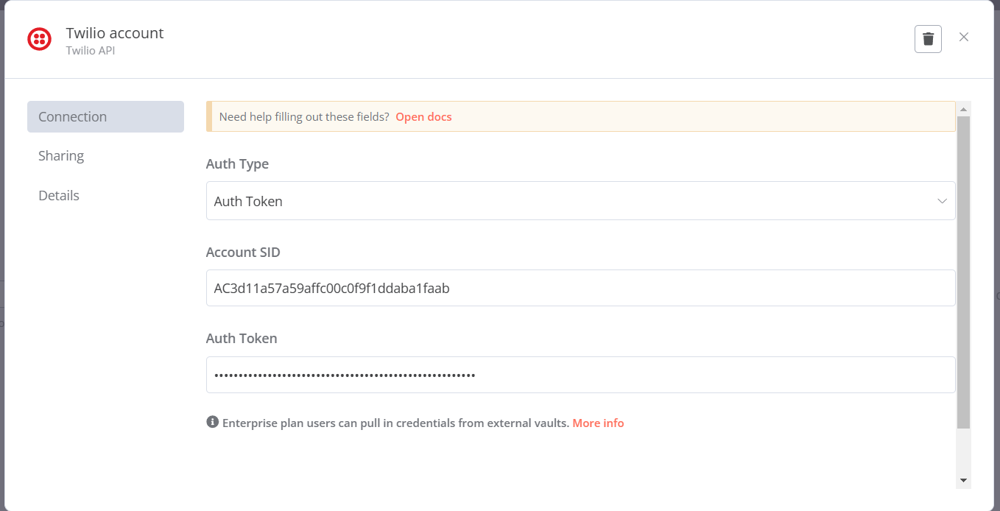
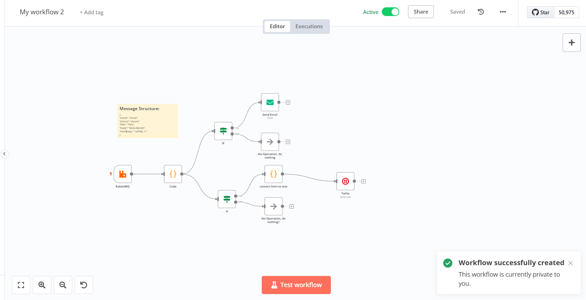

<a id="readme-top"></a>
<br />

<div align="center">
  <a href="https://github.com/UTE-SafeYou">
    
  </a>

  <h3 align="center">Safe You BaaS</h3>

  <p align="center">
   Phần mềm mã nguồn mở ở phía nội bộ cho Safe You  
    <br />
    <a href="https://ute-safeyou.github.io/safeyou-docs/"><strong>Tài liệu phát triển</strong></a>
    <br />
    <br />
    <a href="https://olp-asm.huuloc.id.vn/app/safeyou-internals/admin-authentication-67543a23fd51167a0308d7b7?branch=master">Online demo</a>
    ·
    <a href="https://github.com/UTE-SafeYou/safeyou-baas/issues/new?assignees=&labels=&projects=&template=%F0%9F%90%9E-b%C3%A1o-c%C3%A1o-l%E1%BB%97i-.md&title=">Báo cáo lỗi</a>
    ·
    <a href="https://github.com/UTE-SafeYou/safeyou-baas/issues/new?assignees=&labels=&projects=&template=y%C3%AAu-c%E1%BA%A7u-t%C3%ADnh-n%C4%83ng.md&title=">Yêu cầu tính năng</a>
  </p>
</div>

## Về Safe You BaaS 👋

Safe You BaaS là hệ thống backend mã nguồn mở hỗ trợ nền tảng Safe You, cung cấp hạ tầng mạnh mẽ với các công nghệ hiện đại như RabbitMQ, n8n, Supabase và Edge Functions. Dự án mang đến các tính năng chính bao gồm hệ thống cảnh báo khẩn cấp qua SMS, email và thông báo theo GPS, quản lý tình nguyện viên, chợ tình thương, cập nhật thông tin an toàn và đóng góp thông tin theo khu vực. Safe You BaaS tuân theo kiến trúc microservices và sử dụng Docker để dễ dàng triển khai và mở rộng. Dự án thân thiện với lập trình viên, có tài liệu chi tiết và quá trình cài đặt đơn giản.

Các plugins đội phát triển dựa trên supabase nằm trong thư mục: `supabase/functions`

Bạn có thể xem hướng dẫn cách cài đặt, cách sử dụng plugin tại đây: [Hướng dẫn cài đăt](https://ute-safeyou.github.io/safeyou-docs/H%C6%B0%E1%BB%9Bng-d%E1%BA%ABn-c%C3%A0i-%C4%91%E1%BA%B7t/Baas/install/)

## Hướng dẫn cài đặt backend

### Yêu cầu hệ thống
- [Node.js](https://nodejs.org/en/) >= 14.x
- [Docker](https://docs.docker.com/get-docker/)
- [Docker Compose](https://docs.docker.com/compose/install/)
- [n8n](https://docs.n8n.io/getting-started/installation)
- [RabbitMQ](https://www.rabbitmq.com/download.html)
- [Git](https://git-scm.com/)
- [Supabase CLI](https://supabase.io/docs/guides/cli)

### Các bước cài đặt

#### 1. Clone mã nguồn từ Github:
```sh
git clone https://github.com/UTE-SafeYou/safeyou-baas.git
```

#### 2. Chuyển vào thư mục mã nguồn:

```sh
cd safeyou-baas
```

#### 3. Khởi tạo n8n và RabbitMQ:

```sh
docker-compose up -d
```

#### 4. Khởi động supabase:

```sh
supabase start
```

#### 5. Khởi tạo local database:

```sh
supabase db reset
```

#### 6. Thiết lập các biến môi trường:

```sh
cp supabase/.env.example supabase/.env
```

#### 7. Khởi động Edge Function:

```sh
supabase functions serve --env-file supabase/.env
```

#### 8. Thiết lập n8n workflow:
   - Truy cập vào địa chỉ `http://localhost:5678`
   - Chọn import from file
<p align="center">
    
</p>
   - Chọn file trong `safeyou-baas\automation\Send_Notification.json`
<p align="center">
    
</p>
   - Thêm các biến môi trường trong workflow
<p align="center">
    
</p>
<p align="center">
    
</p>
<p align="center">
    
</p>
   - Lưu workflow
   - Chạy workflow

<p align="center">
    
</p>

<p align="right">(<a href="#readme-top">trở lên đầu</a>)</p>

## Tài liệu kỹ thuật

Bạn có thể xem tài liệu kỹ thuật của Safe You tại [đây](https://ute-safeyou.github.io/safeyou-docs/).

<p align="right">(<a href="#readme-top">trở lên đầu</a>)</p>

<!-- ROADMAP -->

## Lộ trình

- [x] Phát triển hệ thống cảnh báo
- [x] Hệ thống tình nguyện viên
- [x] Hệ thống chợ tình thương
- [x] Hệ thống cập nhật thông tin
- [x] Hệ thống đóng góp thông tin
- [x] Hệ thống gửi cảnh báo đến người dùng
- [x] Hệ thống phân công nhiệm vụ
- [ ] Tích hợp phân tích dữ liệu
- [ ] Tích hợp hệ thống nguồn mở với thiết bị IoT

Bạn có thể xem [issues](https://github.com/UTE-SafeYou/UTE-SafeYou/issues) để biết thêm danh sách các tính năng được đề xuất (và các vấn đề đã biết).

<p align="right">(<a href="#readme-top">trở lên đầu</a>)</p>

<!-- CONTRIBUTING -->

## Đóng góp

Những đóng góp quý báu của bạn làm cho cộng đồng mã nguồn mở trở nên tuyệt vời hơn. Mọi đóng góp bạn đều được đánh giá cao và Safe You rất biết ơn về điều đó.

Nếu bạn có đề xuất nào giúp dự án trở nên tốt hơn, hãy fork dự án và tạo một pull request. Bạn cũng có thể đơn giản mở một issue với tag "enhancement" hoặc ấn vào các đường dẫn sau:

1. Báo cáo lỗi: [Báo cáo lỗi](https://github.com/UTE-SafeYou/safeyou-internals/issues/new?assignees=&labels=&projects=&template=b%C3%A1o-c%C3%A1o-l%E1%BB%97i.md&title=báo-cáo-lỗi)
2. Yêu cầu tính năng: [Yêu cầu tính năng](https://github.com/UTE-SafeYou/safeyou-internals/issues/new?assignees=&labels=&projects=&template=y%C3%AAu-c%E1%BA%A7u-t%C3%ADnh-n%C4%83ng.md&title=)

Ngoài Github, Safe You cũng se tổng hợp các lỗi và hướng dẫn hỗ trợ [tại đây](https://docs.google.com/spreadsheets/d/16oQy8kBOMlrbtV0BpOXKJEzr7BDqgaNaqXXxt4xpibk/edit?usp=sharing)

<!-- LICENSE -->

## Giấy phép

Sau khi tham khảo, nhóm Safe You quyết định sử dụng giấy phép [GNU - General Public License v3.0]().

<p align="right">(<a href="#readme-top">trở lên đầu</a>)</p>

<!-- CONTACT -->

## Liên lạc

Chúng tôi luôn sẵn sàng hỗ trợ bạn bất cứ khi nào
[Facebook](https://www.facebook.com/safeyouteam)

Ngoài ra bạn cũng có thể gửi email cho Safe You Team qua địa chỉ: `safeyouteam@gmail.com`

Các lập trình viên của khởi đầu dự án Safe You:

- Trần Công Toản - [tctoan1024@gmail.com](mailto:tctoan1024@gmail.com)
- Lâm Hoài Kim Ngân - [22133036@student.hcmute.edu.vn](mailto:22133036@student.hcmute.edu.vn)
- Nguyễn Hữu Lộc - [22110179@student.hcmute.edu.vn](mailto:22110179@student.hcmute.edu.vn)

<p align="right">(<a href="#readme-top">trở lên đầu</a>)</p>
